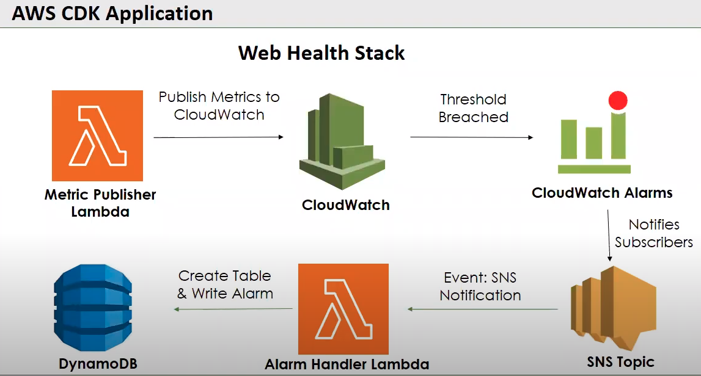
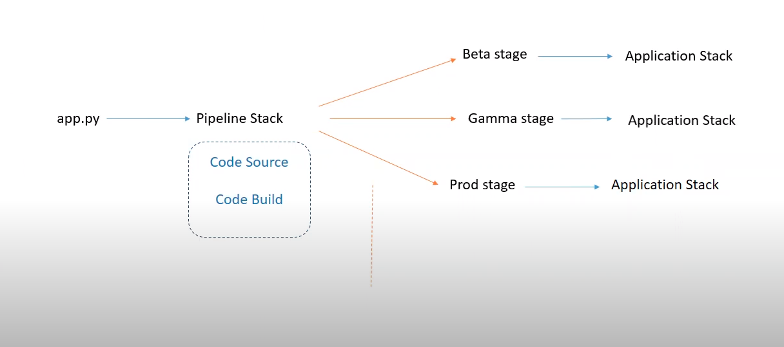

# CI/CD Pipeline for a Web Health App Project!

This is project which get the metrics of a website **latency** and **availability** and notify users and write data to databse when certain metric reaches a threshold value.

The AWS Pipeline will be be used to create CI/CD to automate integrating and deploying new changes to the project.

<br>
<br>

[Seting up the Project](#seting-up-the-project)

[AWS services used in this project](#aws-services-used-in-this-project)

[Project Flow](#project-flow)

[Application Architecture Diagrams](#application-architecture-diagrams)

[API Gateway Endpoint Methods](#api-gateway-endpoint-methods)

[Useful commands](#useful-commands)

<br>


## Seting up the Project

To start with the project:

Create a virtualenv on MacOS and Linux:

```
$ python3 -m venv .venv
```

After the init process completes and the virtualenv is created, you can use the following
step to activate your virtualenv.

```
$ source .venv/bin/activate
```

If you are a Windows platform, you would activate the virtualenv like this:

```
% .venv\Scripts\activate.bat
```

Once the virtualenv is activated, you can install the required dependencies.

```
$ pip install -r requirements.txt
```

At this point you can now synthesize the CloudFormation template for this code.

```
$ cdk synth
```

Finally, to deploy your stack to AWS.

```
$ cdk deploy
```

And if you have multiple AWS account configured then you need to pass the `--profile` parameter.

```
$ cdk deploy <PipelineStackName> --profile username
```

## AWS services used in this project

This project requires follwing services to run

- AWS Lambda
- IAM Role
- CloudWatch alarms and metrics
- SNS
- Amazon DynamoDB
- CloudFormation
- EventBridge scheduler
- CodeBuild
- CodePipeline
- API Gateway

## Project Flow
A **Lambda** is used to get metrics of a website which will be run after every 60 mins defined by the **EventBridge** scheduler rule.

The Lambda wil send metrics to **CloudWatch** and the alarms are set in the CloudWatch. When the metric will reach a certain threshold, it will trigger the **SNS**.

The SNS will send notification to users and and will trigger another **Lambda** which will write metrics data to **DynamoDB** table.

An **API Gateway** is to create **REST API** which is backed by **Lambda** for **CRUD** operations. The data will be written and read from **DynamoDB**.

The data written in this DynamoDB will be read by the first Lambda for metrics of websites returned by DynamoDB from a **GET** method call.

The pipeline will be used to deploy the infrasture required for this project in the AWS Cloud.

## Application Architecture Diagrams
Web health app architecture diagram


CI/CD Pipeline Structure Diagram


AWS CodePipeline Flow Diagram


## API Gateway Endpoint Methods
In this project, we have created **REST API with AWS API Gateway** backed by **Lambda**.

API Gateway will generate URL which will be used to send HTTP requests at. Following methods can be used to send request to this URL generated by API Gateway:

* **GET**
* **POST**
* **PUT**
* **DELETE**

The methods are being used for **CRUD** operations in DynamoDB through Lambda

- GET: https://api-url/prod/urls will scan the DyanmoDB and will return all the records in db
- GET:  https://api-url/prod/urls?id=url-id will return the specific url from the db
- POST: https://api-url/prod/urls is used to add data to DynamoDB. Data needs to be in the body in a `JSON` format
```
{
    "url": "https://www.google.com"
}
```
- PUT: https://api-url/prod/urls is used for updating the record with specified id. Data is also needed to be passed in body in a `JSON` format
```
{
    "id": "url-id",
    "url": "https://webstresser.org"
}
```
- DELETE: https://api-url/prod/urls?id=url-id will delete the url for the given url id from the db

## Useful commands

 * `cdk ls`          list all stacks in the app
 * `cdk synth`       emits the synthesized CloudFormation template
 * `cdk deploy`      deploy this stack to your default AWS account/region
 * `cdk diff`        compare deployed stack with current state
 * `cdk docs`        open CDK documentation
